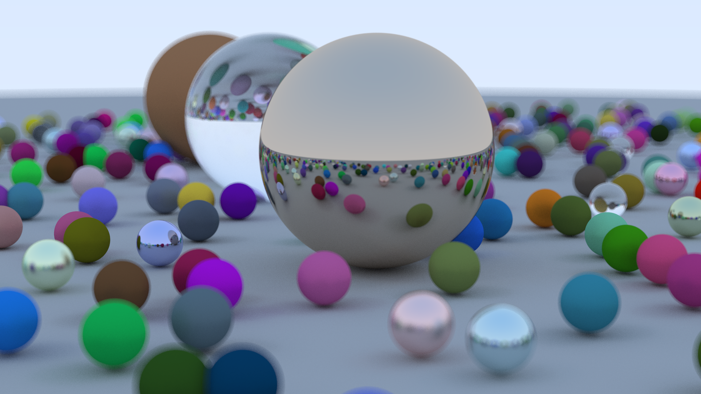

# Raytracer

Multi-threaded CPU raytracer implemented in Rust following
[_Ray Tracing in One Weekend_](https://raytracing.github.io/books/RayTracingInOneWeekend.html).



## Features
 - Different materials
   - Diffuse (Lambertion)
   - Metal
   - Glass (reflection & refraction)
 - Multisampling / Antialiasing
 - Defocus blur (depth of field)
 - Bounding Volume Hierarchies
 - Multithreading

## Details

The scene in the above image rendered at 1920x1080 resolution in roughly 80 seconds on my machine
(Ryzen R5 5600X CPU).
Each pixel is the result of 200 samples, meaning 200 rays were sent into the scene and averaged
to get the pixel color. Each ray got reflected and refracted a maximum of 50 times.

The scene contains many randomly generated spheres of different materials: diffuse, metal and glass.
 - The diffuse materials have a rather soft, non-reflective surface with given colours.
 - The metal sphere also have their own base colours but reflect light depending on their fuzziness.
 - The glass balls either reflect or refract the rays that hit them depending on the angle and random chance, however they do not have any intrinsic color.

Additionally there is a depth of field effect generated by randomly, slightly offsetting the
origin of each ray slightly from the origin of the camera so that objects outside of the focal plane receive some blur. 

The scene to be rendered is turned into a Bounding Volume Hierarchy to reduce the necessary computations.
To do that, the set of objects gets split in half over and over again based on their X, Y or Z
coordinate. This way when a ray gets sent into the world and needs to check if it hits any objects
it can very quickly reduce the number of candidates.
At the highest level the set of objects is split into two groups. If the ray doesn't intersect
the bounding box of the first group that means that entire half of the set of objects can be discarded.
If one of the bounding volumes is intersected by the ray the children of that volume are considered.
Once again this means two groups are considered, each containing half of their parents set of objects.
This way the set of objects that need to be checked get halved at very step, allowing for very efficient
intersection checks, as opposed to having to linearly search through a list for every single ray.

By default the raytracer will create a threadpool with on thread per CPU core. The pixels to be rendered
are essentially submitted to this threadpool in a queue. This means N pixels can be calculated in parallel,
where N is the number of CPU cores.
The number of threads can be changed by setting the `RAYON_NUM_THREADS` environment variable
before running the program.

## Usage

**Note:** To compile this project please install the [Rust compiler](https://rust-lang.org/).

For a debug build run `cargo build` in the project directory. For an optimized release
build please run `cargo build --release`.
The resulting binaries will be located in `./target/debug` and `./target/release` respectively.

It is also possible to use `cargo run` or `cargo run --release` to compile and run the program in one step.

It is recommended to use the release build since it significantly speeds up the execution.

The raytracer accepts a few command line arguments to change the behaviour, the following
help output can be produced with `./raytracer_rs --help`:
```
Usage: raytracer_rs.exe [OPTIONS]

Options:
  -o, --output-filename <OUTPUT_FILENAME>
          Name of the output image [default: out.png]
      --width <WIDTH>
          Width of the output image [default: 1280]
      --height <HEIGHT>
          Height of the output image [default: 720]
      --fov <FOV>
          Vertical field of view [default: 20]
      --focus-distance <FOCUS_DISTANCE>
          Distance of the focal point from the camera [default: 10]
      --defocus-angle <DEFOCUS_ANGLE>
          Determines the strength of the depth of field effect [default: 0.6]
      --samples <SAMPLES>
          Number of samples (rays) per pixel [default: 100]
      --max-bounces <MAX_BOUNCES>
          Maximum amount of times a ray can get hit and bounce from objects [default: 50]
  -h, --help
          Print help
  -V, --version
          Print version
```

To replicate the sample image the following command was used:
```
.\raytracer_rs -o sample.png -width 1920 -height 1080 --samples 200
```

## License

Licensed under the [MIT License](./LICENSE).
